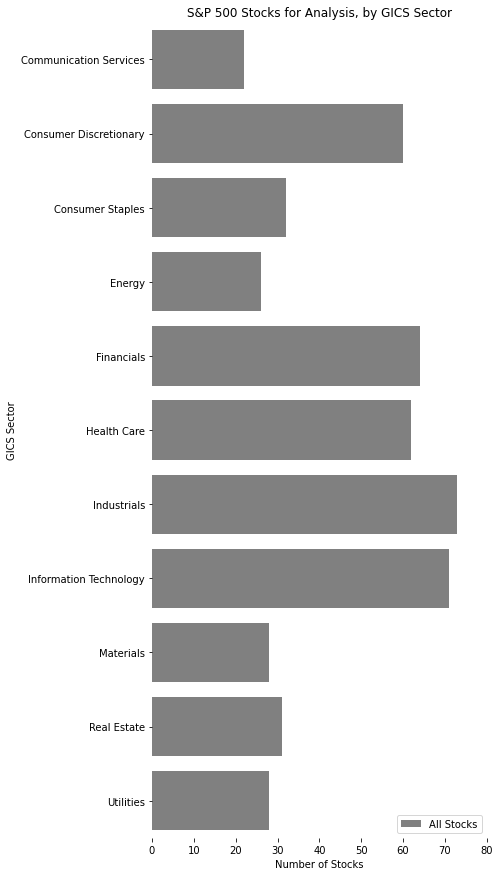

A first-year project for the University of Michigan's Master of Applied Data Science program's Milestone I class.

This project seeks to deploy a data pipeline that independently, from start to finish, scrapes S&P 500 names, pulls fundamentals data through Quandl and pricing data from Yahoo!Finance, then, through a series of easily modifiable code, filters for value stocks and returns a dataframe of possible options with relevant investing metrics.

# Value Investing Stock Picks
#### <i>Allie Bergmann and Chris Thorne</i>

### Project Summary
This project will analyze the underlying components of major market indices to identify company stocks that are trading at a discount to their value. We will determine this value using a Price-to-Book (P/B) ratio, and filtering stocks additionally based the following criteria on a yearly reporting basis:

* Earnings Per Share (EPS) Increased over the previous year
    * Indicates a trend of increasing value per share to investors year-over-year.
* Return on Equity (ROE) > 10%
    * Indicates an effective use of investor funds to generate profits.
* Return on Assets (ROA) Increased over the previous year
    * Similar to ROE, but accounts for company debts instead of just equity, and indicates an increase in company profitability relative to its total assets year over-year.

With publicly available data, we will be able to calculate a valuation for each stock, then isolate which are trading below that valuation. Since the metric we will be using to provide a price target does not necessarily account for intangible assets (common in technology companies), we have also added the additional metrics in our filtering process to consider the other factors contributing to a company’s growth and efficiency. These value stocks are often posited in the financial world to have more potential for greater upside, as they are trading below the price that they are deemed to be worth.

The goal and motivation of the project is to efficiently and quickly identify stock picks that may be suitable for a value investing portfolio using data sources. Previously, all of these stocks would have had to have been modeled and analyzed painstakingly by hand or in Excel.

Questions we want to answer include:
* What is an appropriate valuation for the stock price, based on P/B?
* Is the current stock price above or below that valuation?
* Which of the stocks in the popular indexes, like the S&P 500, are trading below our valuation, and thus have the potential for greater returns?

### Data Sources
#### Data Source #1 - US Equities Fundamentals Data:
* <b>Name</b>: Quandl - “Core US Fundamentals Data (Published by Sharadar)”
* <b>Description</b>: Updated daily, this database provides 5 years of history, for 111 essential fundamental indicators and financial ratios.
* <b>Size</b>: Dictionary of 499 keys, containing 10,873 records of data (total), with 111 columns of fundamentals metrics data per key.
* <b>Data Location</b>:https://www.quandl.com/databases/SF1
* <b>Format</b>: Table Views
* <b>Access Method</b>: API via a Quandl Python Library (Paid Academic License Acquired)

#### Data Source #2 - US Equities - S&P 500:
* <b>Name</b>: List of S&P 500 companies
* <b>Description</b>: List of current companies in the S&P 500.
* <b>Size</b>: Dataframe containing 505 rows and 5 columns of data.
* <b>Data Location</b>: https://en.wikipedia.org/wiki/List_of_S%26P_500_companies
* <b>Format</b>: Table Views
* <b>Access Method</b>: Fetching and parsing an HTML page

#### Data Source #3 - US Equities Historic Prices:
* <b>Name</b>: yfinance
* <b>Description</b>: An API to download 5 years of historical market data from Yahoo! Finance
* <b>Size</b>: Dictionary of 497 keys, containing 10,829 records of data (total), with 7 columns of
additional pricing data per key.
* <b>Data location</b>: https://pypi.org/project/yfinance/
* <b>Format</b>: Table Views
* <b>Access method</b>: API via a yfinance Python Library

## Data Manipulation Methods and Process Analysis
#### Part 1 - Collecting stock ticker symbols from popular indices:
Initial collection of stock ticker data utilized a pandas read_html call to the corresponding Wikipedia website for Data Source #2. This generates a dataframe that we will later leverage for iteration through the Quandl and yfinance APIs. The dataframe initially contains nine columns, but we will remove the SEC filings, Headquarters Location, Date First Added, and CIK columns as they will not be useful in our analysis. (`data_collector.sp500_list_retrieval()`)

#### Part 2a - Collecting historical fundamental data on individual companies:
Once we have a dataframe of stocks, we will isolate the Symbols list to acquire the tickers for which we need data. The list will be run through the Quandl API on a loop. With the Quandl API, there are a few occurrences of missing data. These are primarily due to companies with multiple share classes, where it recognizes one and not the other. Additionally, a few are missing because they may not be available in the Quandl dataset. We will eliminate these from consideration altogether, as there is really no way to acquire this information without an additional API, and filling in financial information by hand is not really appropriate or efficient (would require hand-combing financial reports).

Fortunately, this dataset is fairly clean to start. Quandl has done an excellent job of maintaining an up-to-date database. This data is being delivered in a time series format, and will be grouped and analyzed by dates and keys (tickers). Since nearly all of the metrics we will be using are readily available, there will be minimal calculations required to arrive at our price targets and eligibility criteria. (`data_collector.fundamentals_data_pull()`)

#### Part 2b - Collecting historical stock price data on individual companies:
In Step 2b, we will actually leverage the dictionary returned by Step 2a. We will iterate through each dataframe of ticker information and append the most recent data. Since financial reporting dates are typically at the end of the month regardless of day of the week, there exist many instances of there being a mismatch between dates on pricing and fundamentals data. To combat this, we will merge the datasets and sort by the date in descending order, backfilling the data so as to show the most recent value. This will allow us to see the most recent closing price as of the day of reporting, and most recent reporting numbers (though this data ended up not being used). Additionally, we will set a current price as its own column, so that comparisons may be made at each observation to the current state of the stock price.

In cases where data is not available for a stock, we will again remove the stock from the dataset. Similarly, missing data may be a lack from the API (meaning we would require an additional source) or it would need to be manually entered, which on a daily basis is simply not realistic or efficient.(`data_collector.pricing_data()`)

#### Part 3 - Analysis to calculate value metrics and relation to price:
In step 3, we take the data acquired from Steps 2a and 2b and start comparing metrics and developing filters. To do this, we will iterate through the dictionaries (key, value pairs being ticker, data dataframes) and apply the below logics to generate boolean columns for each.

In order to better demonstrate the process of the value stock picker analysis, we produced a set of visualizations that show how stocks are being filtered down. Important note - the actual Python code that applies the value filters described earlier in this document are applied in parallel and not incrementally as seen below, <i>but for the purpose of illustrating the impact of each these filters</i>, we’ve broken down each step to show the impact that these filters have on resulting stock picks.

## Looking at the Data and Generating Hypotheses
Before we start filtering data, we can see the distribution of S&P 500 companies by sector. Our initial dataset, once we have appended the appropriate fundamentals and pricing data and eliminated any tickers with missing data points, will contain 497 stocks.

 S&P 500 Distribution

The S&P 500 is weighted by market capitalization, meaning larger companies have more impact on the movement of the index, but those companies may fall in different sectors, as we can see below. Coincidentally, at the time of this writing, Information Technology and Consumer Discretionary contain some of the largest companies (MSFT, AAPL, FB, etc.) and are also some of our largest subsets.

The larger, more popular companies with high prices are unlikely to meet our filtering criteria, as “value stock” indicates that the price is <i>undervalued</i> compared to the company’s actual book value.

Because of the current COVID-19 situation affecting markets, we would expect things like tech, healthcare, communication services, and consumer staples to be overvalued, as many are flooding to them due to their societal value right now. Conversely, we would expect to see prices for banks and financial firms (real estate, etc.) suppressed quite a bit, due to the low interest rate environment and uncertainty surrounding defaults on mortgages and other financial instruments,
upon whose revenue they rely. Because of this, we hypothesize that our results will show a tendency towards the financial sector.

To explore this hypothesis further, we will apply a filter that checks for this concept of “book value”. As with all of our filtering criteria, a boolean column will be created for each filtering metric, and if a stock meets the criteria it is labeled True, if it does not or contains missing data pertaining to those metrics, it is labeled False.

